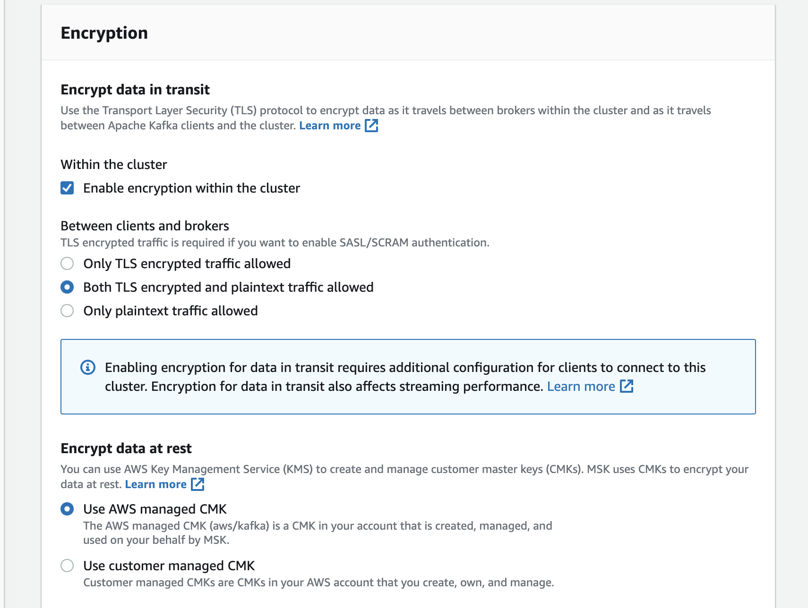
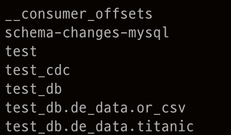

# debezium_cdc
### 실시간 cdc 파이프 라인 mysql -> s3
  
---
## 1. aws-cli 준비
aws msk의 configuration 파일은 aws CLI을 사용해서 생성이 가능하기 때문에 먼저 aws CLI를 설치하고 설정할 필요가 있다.
### 1.1 aws cli 설치
```shell
curl "https://awscli.amazonaws.com/awscli-exe-linux-x86_64.zip" -o "awscliv2.zip"
unzip awscliv2.zip
sudo ./aws/install
```
### 1.2 aws cli 설정
```
aws configure
AWS Access Key ID [None]: access key
AWS Secret Access Key [None]: secret key
Default region name [None]: ap-northeast-2
Default output format [None]: json
```

## 1. kafka 패키지 설치
#### 동일 vpc 내에 있는 ec2에 접속하여 작업을 진행한다.
```bash
apt-get update 
sudo apt-get install default-jre

# Install java on the client machine using the following command: sudo yum install java-1.8.0
# Download and unzip Apache Kafka on the client computer:
wget https://archive.apache.org/dist/kafka/2.2.1/kafka_2.12-2.2.1.tgz
tar -xzf kafka_2.12-2.2.1.tgz
```
#### install debeizum confluent kafka connector
```
wget -qO - https://packages.confluent.io/deb/5.3/archive.key | sudo apt-key add -
sudo add-apt-repository "deb [arch=amd64] https://packages.confluent.io/deb/5.3 stable main"
sudo apt-get update && sudo apt-get install confluent-hub-client confluent-common confluent-kafka-2.12
```

---
## 2. msk conf 파일 작성
msk의 conf파일은 cli나 콘솔로 작성할 수 있다. 
### 2.1 conf 파일 생성
```
auto.create.topics.enable = true
zookeeper.connection.timeout.ms = 1000
```
위 내용을 conf파일로 작성해야 합니다.하지만 kafka conf는 base64만 인식 할 수 있어 base64로 변경해야 한다. 
```
vi ./kafka.conf 

YXV0by5jcmVhdGUudG9waWNzLmVuYWJsZSA9IHRydWUKem9va2VlcGVyLmNvbm5lY3Rpb24udGltZW91dC5tcyA9IDEwMDA=
```

### 2.2 aws에 conf 업로드
```
aws kafka create-configuration --name "{conf name}" --description "test description" --kafka-versions "{aws kafka version}" --server-properties file://{file path}
```
1. conf name : aws에서 보여질 kafka conf 이름
1. aws kafka version : 사용할 aws kafka 버전
1. file path : kafka.conf 파일 위치 

---

## 3. Aws Msk 실행
### 3.1 Kafka 생성


#### network 설정

추후 kafka 설정을 위해 network의 vpc는 Ec2와 동일하게 설정한다

#### Encryption



---

### 4.2 kafka topic 생성
```bash
./kafka_2.12-2.2.1/bin/kafka-topics.sh  --create --zookeeper {ZooKeeper connection plaintext} --replication-factor 2 --partitions 1 --topic 1
```
#### 예제
```bash
bin/kafka-topics.sh  --create --zookeeper z-1.debnezium-test.rhp5hh.c4.kafka.ap-northeast-2.amazonaws.com:2181,z-2.debnezium-test.rhp5hh.c4.kafka.ap-northeast-2.amazonaws.com:2181,z-3.debnezium-test.rhp5hh.c4.kafka.ap-northeast-2.amazonaws.com:2181 --replication-factor 2 --partitions 1 --topic 1
```

### 4.3 set kafka connect-distribute
`vi /etc/kafka/connect-distributed.properties`
```
bootstrap.servers={Bootstrap connection plaintext}
group.id=debezium-cluster
offset.storage.replication.factor=2
config.storage.replication.factor=2
status.storage.replication.factor=2
key.converter=org.apache.kafka.connect.json.JsonConverter
value.converter=org.apache.kafka.connect.json.JsonConverter
key.converter.schemas.enable=false
value.converter.schemas.enable=false
config.storage.topic=1
offset.storage.topic=1
status.storage.topic=1
plugin.path=/usr/share/java,/usr/share/confluent-hub-components
```

### 4.4 Install Debezium MySQL connector and S3 connector:
```
confluent-hub install debezium/debezium-connector-mysql:latest
confluent-hub install confluentinc/kafka-connect-s3:latest
```
### 4.5 set up connector service
`vi /lib/systemd/system/confluent-connect-distributed.service`
```
[Unit]
Description=Apache Kafka - connect-distributed
Documentation=http://docs.confluent.io/
After=network.target
[Service]
Type=simple
User=cp-kafka
Group=confluent
ExecStart=/usr/bin/connect-distributed /etc/kafka/connect-distributed.properties
TimeoutStopSec=180
Restart=no
[Install]
WantedBy=multi-user.targe
```
#### service 등록 & 실행
```
systemctl enable confluent-connect-distributed
systemctl start confluent-connect-distributed
```

#### 상태 확인
```
systemctl status confluent-connect-distributed
```

### 4.6 토픽 리스트 확인

```
./bin/kafka-topics.sh --list --zookeeper {ZooKeeper connection plaintext} &
```


---
## 5. mysql connector
### 5.1 mysql connector 설정 구성
mysql.json 파일을 생성하여 아래 내용을 작성한다
```json
{
 "name": "mysql-connector-db01",
 "config": {
  "name": "mysql-connector-db01",
  "connector.class": "io.debezium.connector.mysql.MySqlConnector",
  "database.server.id": "1",
  "tasks.max": "3",
  "database.history.kafka.bootstrap.servers": "{bootstrap servers plaintext}",
  "database.history.kafka.topic": "test_cdc",
  "database.server.name": "test_db",
  "database.hostname": "localhost",
  "database.port": "3306",
  "database.user": "root",
  "database.password": "your_strong_pass",
  "database.whitelist": "test1, test2, test3",
  "internal.key.converter.schemas.enable": "false",
  "transforms.unwrap.add.source.fields": "ts_ms",
  "key.converter.schemas.enable": "false",
  "internal.key.converter": "org.apache.kafka.connect.json.JsonConverter",
  "internal.value.converter.schemas.enable": "false",
  "value.converter.schemas.enable": "false",
  "internal.value.converter": "org.apache.kafka.connect.json.JsonConverter",
  "value.converter": "org.apache.kafka.connect.json.JsonConverter",
  "key.converter": "org.apache.kafka.connect.json.JsonConverter",
  "transforms": "unwrap",
  "transforms.unwrap.type": "io.debezium.transforms.ExtractNewRecordState"
 }
}
```
1. database.server.name : 데이터 베이스 이름
1. database.hostname : mysql host ip
1. database.port : 포트 번호
1. database.user : 사용자 id
1. database.password : 사용자 password
1. database.history.kafka.topic : database ddl topic
1. database.server.name : 추후 생성되는 토픽 prefix EX) name.<database>.<table> 
1. database.whitelist : 사용할 데이터베이스
1. database.include.list : 사용할 데이터베이스
1. table.include.list : 사용할 테이블 EX) database.table 


### 5.2 mysql connector 등록 
```
curl -X POST -H "Accept: application/json" -H "Content-Type: application/json" http://localhost:8083/connectors -d @mysql.json
```

### 5.3 mysql connector 상태
```
curl GET localhost:8083/connectors/mysql-connector-db01/status
```

#### Result
```json
{
 "name": "mysql-connector-db01",
  "connector": {
    "state": "RUNNING",
    "worker_id": "172.31.44.151:8083"
  },
  "tasks": [
    {
      "id": 0,
      "state": "RUNNING",
      "worker_id": "172.31.44.151:8083"
    }
  ],
  "type": "source"
}
```

### 5.4 데이터 확인
#### 토픽 리스트 확인

```
./bin/kafka-topics.sh --list --zookeeper {ZooKeeper connection plaintext}
```


#### titanic 데이터


#### update titanic data


#### kafka topic 확인



test_db.de_data.titanic 토픽이 생성된 것을 확인할 수 있다.

#### test_db.de_data.titanic 데이터 확인


```bash
./bin/kafka-console-consumer.sh --bootstrap-server {Bootstrap connection plaintext} --topic test_db.de_data.titanic --from-beginning
```


---
## 6. Setup S3 Sink connector in All Producer Nodes
### 6.1 s3.json 파일 생성
```json
{
 "name": "s3-sink-db01",
 "config": {
  "connector.class": "io.confluent.connect.s3.S3SinkConnector",
  "storage.class": "io.confluent.connect.s3.storage.S3Storage",
  "s3.bucket.name": "searce-00000",
  "name": "s3-sink-db01",
  "tasks.max": "3",
  "s3.region": "us-east-1",
  "s3.part.size": "5242880",
  "s3.compression.type": "gzip",
  "timezone": "UTC",
  "locale": "en",
  "flush.size": "10000",
  "rotate.interval.ms": "3600000",
  "topics.regex": "mysql-db01.(.*)",
  "internal.key.converter.schemas.enable": "false",
  "key.converter.schemas.enable": "false",
  "internal.key.converter": "org.apache.kafka.connect.json.JsonConverter",
  "format.class": "io.confluent.connect.s3.format.json.JsonFormat",
  "internal.value.converter.schemas.enable": "false",
  "value.converter.schemas.enable": "false",
  "internal.value.converter": "org.apache.kafka.connect.json.JsonConverter",
  "value.converter": "org.apache.kafka.connect.json.JsonConverter",
  "key.converter": "org.apache.kafka.connect.json.JsonConverter",
  "partitioner.class": "io.confluent.connect.storage.partitioner.HourlyPartitioner",
  "path.format": "YYYY/MM/dd/HH",
  "partition.duration.ms": "3600000",
  "rotate.schedule.interval.ms": "3600000"
 }
}
```
1. s3.bucket.name : s3 버킷 이름
1. name : 버킷내 이름
1. s3.region : aws 리전
1. s3.part.size : 데이터 buffer 사이즈
1. s3.compression.type : 파일 압축 타입 [gzip]
1. flush.size : 파일 추출 사이즈 The data will be uploaded to S3 only after these many number of records stored. Or after "rotate.schedule.interval.ms" this duration.
1. rotate.interval.ms : 
1. topics.regex: 추출할 데이터 토픽
1. path.format : 폴더내 파티션
1. partition.duration.ms : ?
1. rotate.schedule.interval.ms : ?

### 6.2 s3 sink connector 등록
```
curl -X POST -H "Accept: application/json" -H "Content-Type: application/json" http://localhost:8083/connectors -d @s3.json
```

#### s3 상태 확인
```
curl GET localhost:8083/connectors/s3-sink-db01/status |jq
```

Result
```
{
  "name": "s3-sink-db01",
  "connector": {
    "state": "RUNNING",
    "worker_id": "172.31.44.151:8083"
  },
  "tasks": [
    {
      "id": 0,
      "state": "RUNNING",
      "worker_id": "172.31.44.151:8083"
    },
    {
      "id": 1,
      "state": "RUNNING",
      "worker_id": "172.31.44.151:8083"
    },
    {
      "id": 2,
      "state": "RUNNING",
      "worker_id": "172.31.44.151:8083"
    }
  ],
  "type": "sink"
}
```
